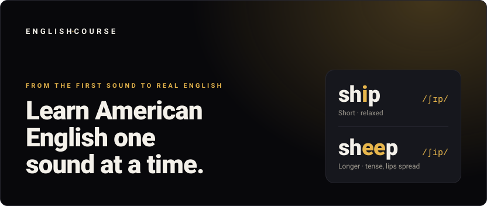
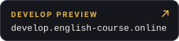
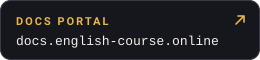

<p align="center">
  
</p>

<p align="center">
  <a href="https://www.english-course.online"></a>
  <a href="https://develop.english-course.online"></a>
  <a href="https://docs.english-course.online"></a>
</p>

<p align="center">
  <a href="https://github.com/HelloMoy/learning-english/actions/workflows/ci.yml"></a>
  <a href="https://github.com/HelloMoy/learning-english/actions/workflows/docs-portal.yml"></a>
  <a href="https://github.com/HelloMoy/learning-english/releases"></a>
  <a href="https://nextjs.org"></a>
  <a href="https://nodejs.org"></a>
</p>

## What this is

English Course is a video course platform for Spanish speakers learning English. Courses run in order — each level assumes the sounds from the one before it — and every lesson pairs a short video with notes in Spanish and English. The interface ships in English, Spanish and Portuguese, and installs to a phone's home screen like an app.

## Environments

| Environment    | URL                                                                    | Branch    | Notes                                                                      |
| -------------- | ---------------------------------------------------------------------- | --------- | -------------------------------------------------------------------------- |
| **Production** | [www.english-course.online](https://www.english-course.online)         | `main`    | On Vercel.<br>Every push is versioned and released.                        |
| **Develop**    | [develop.english-course.online](https://develop.english-course.online) | `develop` | Vercel preview with its own database.<br>Behind Vercel sign-in, team only. |
| **Docs**       | [docs.english-course.online](https://docs.english-course.online)       | `develop` | GitHub Pages, rebuilt on every push.                                       |

The docs portal holds the [design system](https://docs.english-course.online/storybook/), the [API reference](https://docs.english-course.online/api/), the [emails](https://docs.english-course.online/emails/), the [architecture](https://docs.english-course.online/architecture/) and the [changelog](https://docs.english-course.online/changelog/).

Feature branches do not deploy: only `main` and `develop` build, and pull requests run CI.

## Stack

| Layer              | Tools                                           |
| ------------------ | ----------------------------------------------- |
| App                | Next.js 16 (App Router) · React 19 · TypeScript |
| Interface          | Tailwind 4 · shadcn/ui · Storybook              |
| Data               | Drizzle · Turso (libSQL)                        |
| Accounts and email | Better Auth · React Email                       |
| Languages          | next-intl — English, Spanish, Portuguese        |
| Tests              | Vitest · Testing Library · Playwright           |

The domain follows a hexagonal architecture: `src/domain` imports only `zod` and `neverthrow`, and everything else reaches it through a port.

## Run it locally

Needs Node 22+, pnpm and Docker.

```bash
pnpm install
cp .env.example .env.local
docker compose up -d        # libSQL database and Mailpit inbox
pnpm db:migrate
pnpm db:seed                # a local learner to sign in with
pnpm dev
```

The app runs at <http://localhost:3000> and the mail inbox at <http://localhost:8025>.

`pnpm verify` runs the type check, format check, lint and unit tests. `pnpm storybook` and `pnpm portal:dev` serve the design system and the docs portal locally.

## How we work

- [AGENTS.md](AGENTS.md) — spec first with OpenSpec, then a failing test, then code.
- [COMMIT_CONVENTIONS.md](COMMIT_CONVENTIONS.md) — Conventional Commits with gitmoji.
- [GLOSSARY.md](GLOSSARY.md) — the shared vocabulary of the course platform.
- [DEPLOYMENT.md](DEPLOYMENT.md) — the production runbook.

AI assistants working in this repository need the skills declared in `skills-lock.json`; install them once with `npx skills install`.
